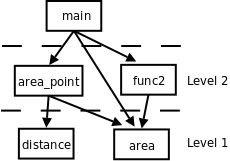
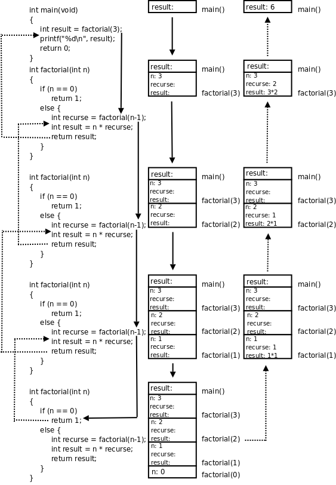

# 第 5 章 深入理解函数

## 1. return 语句

之前我们一直在 `main` 函数中使用 `return` 语句，现在是时候全面深入地学习一下了。在有返回值的函数中，`return` 语句的作用是提供整个函数的返回值，并结束当前函数返回到调用它的地方。在没有返回值的函数中也可以使用 `return` 语句，例如当检查到一个错误时提前结束当前函数的执行并返回：

```c
#include <math.h>

void print_logarithm(double x)
{
	if (x <= 0.0) {
		printf("Positive numbers only, please.\n");
		return;
	}
	printf("The log of x is %f", log(x));
}
```

这个函数首先检查参数 `x` 是否大于 `0`，如果 `x` 不大于 `0` 就打印错误提示，然后提前结束函数的执行返回到调用者，只有当 `x` 大于 `0` 时才能求对数，在打印了对数结果之后到达函数体的末尾，自然地结束执行并返回。注意，使用数学函数 `log` 需要包含头文件 `math.h`，由于 `x` 是浮点数，应该与同类型的数做比较，所以 `if` 语句中写成 `0.0`。

在[上一章「分支语句」第 2 节「if/else 语句」](1-C-语言入门/ch04-分支语句#_2-ifelse-语句)中我们定义了一个检查奇偶性的函数，如果是奇数就打印 `x is odd.`，如果是偶数就打印 `x is even.`。事实上这个函数并不十分好用，我们定义一个检查奇偶性的函数往往不是为了打印两个字符串就完了，而是为了根据奇偶性的不同分别执行不同的后续动作。我们可以把它改成一个返回布尔值的函数：

```c
int is_even(int x)
{
	if (x % 2 == 0)
		return 1;
	else
		return 0;
}
```

有些人喜欢写成 `return(1);` 这种形式也可以，表达式外面套括号表示改变运算符优先级，在这里不起任何作用。我们可以这样调用这个函数：

```c
int i = 19;
if (is_even(i)) {
	/* do something */
} else {
	/* do some other thing */
}
```

返回布尔值的函数是一类非常有用的函数，在程序中通常充当控制表达式，函数名通常带有 `is` 或 `if` 等表示判断的词，这类函数也叫做谓词（Predicate）。`is_even` 这个函数写得有点啰嗦，`x % 2` 这个表达式本来就有 `0` 值或非 `0` 值，直接把这个值当作布尔值返回就可以了：

```c
int is_even(int x)
{
	return !(x % 2);
}
```

函数的返回值应该这样理解：函数返回一个值相当于定义一个和返回值类型相同的临时变量并用 `return` 后面的表达式来初始化。例如上面的函数调用相当于这样的过程：

```c
int 临时变量 = !(x % 2);
函数退出，局部变量 x 的存储空间释放;
if (临时变量) { /* 临时变量用完就释放 */
	/* do something */
} else {
	/* do some other thing */
}
```

当 `if` 语句对函数的返回值做判断时，函数已经退出，局部变量 `x` 已经释放，所以不可能在这时候才计算表达式 `!(x % 2)` 的值，表达式的值必然是事先计算好了存在一个临时变量里的，然后函数退出，局部变量释放，`if` 语句对这个临时变量的值做判断。注意，虽然函数的返回值可以看作是一个临时变量，但我们只是读一下它的值，读完值就释放它，而不能往它里面存新的值，换句话说，函数的返回值不是左值，或者说函数调用表达式不能做左值，因此下面的赋值语句是非法的：

```c
is_even(20) = 1;
```

在[第 3 章「简单函数」第 3 节「形参和实参」](1-C-语言入门/ch03-简单函数#_3-形参和实参)中讲过，C 语言的传参规则是 Call by Value，按值传递，现在我们知道返回值也是按值传递的，即便返回语句写成 `return x;`，返回的也是变量 `x` 的值，而非变量 `x` 本身，因为变量 `x` 马上就要被释放了。

在写带有 `return` 语句的函数时要小心检查所有的代码路径（Code Path）。有些代码路径在任何条件下都执行不到，这称为 Dead Code，例如把 `&&` 和 `||` 运算符记混了（据我了解初学者犯这个低级错误的不在少数），写出如下代码：

```c
void foo(int x, int y)
{
	if (x >= 0 || y >= 0) {
		printf("both x and y are positive.\n");
		return;
	} else if (x < 0 || y < 0) {
		printf("both x and y are negetive.\n");
		return;
	}
	printf("x has a different sign from y.\n");
}
```

最后一行 `printf` 永远都没机会被执行到，是一行 Dead Code。有 Dead Code 就一定有 Bug，你写的每一行代码都是想让程序在某种情况下去执行的，你不可能故意写出一行永远不会被执行的代码，如果程序在任何情况下都不会去执行它，说明跟你预想的不一样，要么是你对所有可能的情况分析得不正确，也就是逻辑错误，要么就是像上例这样的笔误，语义错误。还有一些时候，对程序中所有可能的情况分析得不够全面将导致漏掉一些代码路径，例如：

```c
int absolute_value(int x)
{
	if (x < 0) {
		return -x;
	} else if (x > 0) {
		return x;
	}
}
```

这个函数被定义为返回 `int`，就应该在任何情况下都返回 `int`，但是上面这个程序在 `x==0` 时安静地退出函数，什么也不返回，C 语言对于这种情况会返回什么结果是未定义的，通常返回不确定的值，等学到[第 19 章「汇编与 C 之间的关系」第 1 节「函数调用」](2-C-语言本质/ch19-汇编与-C-之间的关系#_1-函数调用)你就知道为什么了。另外注意这个例子中把 `-` 号当负号用而不是当减号用，事实上 `+` 号也可以这么用。正负号是单目运算符，而加减号是双目运算符，正负号的优先级和逻辑非运算符相同，比加减的优先级要高。

以上两段代码都不会产生编译错误，编译器只做语法检查和最简单的语义检查，而不检查程序的逻辑<sup>[7]</sup>。虽然到现在为止你见到了各种各样的编译器错误提示，也许你已经十分讨厌编译器报错了，但很快你就会认识到，如果程序中有错误编译器还不报错，那一定比报错更糟糕。比如上面的绝对值函数，在你测试的时候运行得很好，也许是你没有测到 `x==0` 的情况，也许刚好在你的环境中 `x==0` 时返回的不确定值就是 `0`，然后你放心地把它集成到一个数万行的程序之中。然后你把这个程序交给用户，起初的几天里相安无事，之后每过几个星期就有用户报告说程序出错，但每次出错的现象都不一样，而且这个错误很难复现，你想让它出现时它就不出现，在你毫无防备时它又突然冒出来了。然后你花了大量的时间在数万行的程序中排查哪里错了，几天之后终于幸运地找到了这个函数的 Bug，这时候你就会想，如果当初编译器能报个错多好啊！所以，如果编译器报错了，不要责怪编译器太过于挑剔，它帮你节省了大量的调试时间。另外，在 `math.h` 中有一个 `fabs` 函数就是求绝对值的，我们通常不必自己写绝对值函数。

> <sup>[7]</sup> 有的代码路径没有返回值的问题编译器是可以检查出来的，如果编译时加 `-Wall` 选项会报警告。

### 习题

1. 编写一个布尔函数 `int is_leap_year(int year)`，判断参数 `year` 是不是闰年。如果某年份能被 4 整除，但不能被 100 整除，那么这一年就是闰年，此外，能被 400 整除的年份也是闰年。

2. 编写一个函数 `double myround(double x)`，输入一个小数，将它四舍五入。例如 `myround(-3.51)` 的值是 -4.0，`myround(4.49)` 的值是 4.0。可以调用 `math.h` 中的库函数 `ceil` 和 `floor` 实现这个函数。

## 2. 增量式开发

目前为止你看到了很多示例代码，也在它们的基础上做了很多改动并在这个过程中巩固所学的知识。但是如果从头开始编写一个程序解决某个问题，应该按什么步骤来写呢？本节提出一种增量式（Incremental）开发的思路，很适合初学者。

现在问题来了：我们要编一个程序求圆的面积，圆的半径以两个端点的座标 (x<sub>1</sub>, y<sub>1</sub>) 和 (x<sub>2</sub>, y<sub>2</sub>) 给出。首先分析和分解问题，把大问题分解成小问题，再对小问题分别求解。这个问题可分为两步：

1. 由两个端点座标求半径的长度，我们知道平面上两点间距离的公式是：

> distance = √((x<sub>2</sub>-x<sub>1</sub>)<sup>2</sup>+(y<sub>2</sub>-y<sub>1</sub>)<sup>2</sup>)

括号里的部分都可以用我们学过的 C 语言表达式来表示，求平方根可以用 `math.h` 中的 `sqrt` 函数，因此这个小问题全部都可以用我们学过的知识解决。这个公式可以实现成一个函数，参数是两点的座标，返回值是 `distance`。

2. 上一步算出的距离是圆的半径，已知圆的半径之后求面积的公式是：

>  area = π·radius<sup>2</sup>

也可以用我们学过的 C 语言表达式来解决，这个公式也可以实现成一个函数，参数是 `radius`，返回值是 `area`。

首先编写 `distance` 这个函数，我们已经明确了它的参数是两点的座标，返回值是两点间距离，可以先写一个简单的函数定义：

```c
double distance(double x1, double y1, double x2, double y2)
{
	return 0.0;
}
```

初学者写到这里就已经不太自信了：这个函数定义写得对吗？虽然我是按我理解的语法规则写的，但书上没有和这个一模一样的例子，万一不小心遗漏了什么呢？既然不自信就不要再往下写了，没有一个平稳的心态来写程序很可能会引入 Bug。所以在函数定义中插一个 `return 0.0` 立刻结束掉它，然后立刻测试这个函数定义得有没有错：

```c
int main(void)
{
	printf("distance is %f\n", distance(1.0, 2.0, 4.0, 6.0));
	return 0;
}
```

编译，运行，一切正常。这时你就会建立起信心了：既然没问题，就不用管它了，继续往下写。在测试时给这个函数的参数是 (1.0, 2.0) 和 (4.0, 6.0)，两点的 `x` 座标距离是 3.0，`y` 座标距离是 4.0，因此两点间距离应该是 5.0，你必须事先知道正确答案是 5.0，这样你才能测试程序计算的结果对不对。当然，现在函数还没实现，计算结果肯定是不对的。现在我们再往函数里添一点代码：

```c
double distance(double x1, double y1, double x2, double y2)
{
	double dx = x2 - x1;
	double dy = y2 - y1;
	printf("dx is %f\ndy is %f\n", dx, dy);

	return 0.0;
}
```

如果你不确定 `dx` 和 `dy` 这样初始化行不行，那么就此打住，在函数里插一条打印语句把 `dx` 和 `dy` 的值打出来看看。把它和上面的 `main` 函数一起编译运行，由于我们事先知道结果应该是 3.0 和 4.0，因此能够验证程序算得对不对。一旦验证无误，函数里的这句打印就可以撤掉了，像这种打印语句，以及我们用来测试的 `main` 函数，都起到了类似脚手架（Scaffold）的作用：在盖房子时很有用，但它不是房子的一部分，房子盖好之后就可以拆掉了。房子盖好之后可能还需要维修、加盖、翻新，又要再加上脚手架，这很麻烦，要是当初不用拆就好了，可是不拆不行，不拆多难看啊。写代码却可以有一个更高明的解决办法：把 Scaffolding 的代码注释掉。

```c
double distance(double x1, double y1, double x2, double y2)
{
	double dx = x2 - x1;
	double dy = y2 - y1;
	/* printf("dx is %f\ndy is %f\n", dx, dy); */
	return 0.0;
}
```

这样如果以后出了新的 Bug 又需要跟踪调试时，还可以把这句重新加进代码中使用。两点的 x 座标距离和 y 座标距离都没问题了，下面求它们的平方和：

```c
double distance(double x1, double y1, double x2, double y2)
{
	double dx = x2 - x1;
	double dy = y2 - y1;
	double dsquared = dx * dx + dy * dy;
	printf("dsquared is %f\n", dsquared);

	return 0.0;
}
```

然后再编译、运行，看看是不是得 25.0。这样的增量式开发非常适合初学者，每写一行代码都编译运行，确保没问题了再写一下行，一方面在写代码时更有信心，另一方面也方便了调试：总是有一个先前的正确版本做参照，改动之后如果出了问题，几乎可以肯定就是刚才改的那行代码出的问题，这样就避免了必须从很多行代码中查找分析到底是哪一行出的问题。在这个过程中 `printf` 功不可没，你怀疑哪一行代码有问题，就插一个 `printf` 进去看看中间的计算结果，任何错误都可以通过这个办法找出来。以后我们会介绍程序调试工具 `gdb`，它提供了更强大的调试功能帮你分析更隐蔽的错误。但即使有了 `gdb`，`printf` 这个最原始的办法仍然是最直接、最有效的。最后一步，我们完成这个函数：

<p id="e5-1">例 5.1. distance 函数</p>

```c
#include <math.h>
#include <stdio.h>

double distance(double x1, double y1, double x2, double y2)
{
	double dx = x2 - x1;
	double dy = y2 - y1;
	double dsquared = dx * dx + dy * dy;
	double result = sqrt(dsquared);

	return result;
}

int main(void)
{
	printf("distance is %f\n", distance(1.0, 2.0, 4.0, 6.0));
	return 0;
}
```

然后编译运行，看看是不是得 5.0。随着编程经验越来越丰富，你可能每次写若干行代码再一起测试，而不是像现在这样每写一行就测试一次，但不管怎么样，增量式开发的思路是很有用的，它可以帮你节省大量的调试时间，不管你有多强，都不应该一口气写完整个程序再编译运行，那几乎是一定会有 Bug 的，到那时候再找 Bug 就难了。

这个程序中引入了很多临时变量： `dx`、`dy`、`dsquared`、`result`，如果你有信心把整个表达式一次性写好，也可以不用临时变量：

```c
double distance(double x1, double y1, double x2, double y2)
{
	return sqrt((x2-x1) * (x2-x1) + (y2-y1) * (y2-y1));
}
```

这样写简洁得多了。但如果写错了呢？只知道是这一长串表达式有错，根本不知道错在哪，而且整个函数就一个语句，插 `printf` 都没地方插。所以用临时变量有它的好处，使程序更清晰，调试更方便，而且有时候可以避免不必要的计算，例如上面这一行表达式要把 `(x2-x1)` 计算两遍，如果算完 `(x2-x1)` 把结果存在一个临时变量 `dx` 里，就不需要再算第二遍了。

接下来编写 `area` 这个函数：

```c
double area(double radius)
{
	return 3.1416 * radius * radius;
}
```

给出两点的座标求距离，给出半径求圆的面积，这两个子问题都解决了，如何把它们组合起来解决整个问题呢？给出半径的两端点座标 (1.0, 2.0) 和 (4.0, 6.0) 求圆的面积，先用 `distance` 函数求出半径的长度，再把这个长度传给 `area` 函数：

```c
double radius = distance(1.0, 2.0, 4.0, 6.0);
double result = area(radius);
```

也可以这样：

```c
double result = area(distance(1.0, 2.0, 4.0, 6.0));
```

我们一直把「给出半径的两端点座标求圆的面积」这个问题当作整个问题来看，如果它也是一个更大的程序当中的子问题呢？我们可以把先前的两个函数组合起来做成一个新的函数以便日后使用：

```c
double area_point(double x1, double y1, double x2, double y2)
{
	return area(distance(x1, y1, x2, y2));
}
```

还有另一种组合的思路，不是把 `distance` 和 `area` 两个函数调用组合起来，而是把那两个函数中的语句组合到一起：

```c
double area_point(double x1, double y1, double x2, double y2)
{
	double dx = x2 - x1;
	double dy = y2 - y1;
	double radius = sqrt(dx * dx + dy * dy);

	return 3.1416 * radius * radius;
}
```

这样组合是不理想的。这样组合了之后，原来写的 `distance` 和 `area` 两个函数还要不要了呢？如果不要了删掉，那么如果有些情况只需要求两点间的距离，或者只需要给定半径长度求圆的面积呢？`area_point` 把所有语句都写在一起，太不灵活了，满足不了这样的需要。如果保留 `distance` 和 `area` 同时也保留这个 `area_point` 怎么样呢？`area_point` 和 `distance` 有相同的代码，一旦在 `distance` 函数中发现了 Bug，或者要升级 `distance` 这个函数采用更高的计算精度，那么不仅要修改 `distance`，还要记着修改 `area_point`，同理，要修改 `area` 也要记着修改 `area_point`，维护重复的代码是非常容易出错的，在任何时候都要尽量避免。因此，**尽可能复用（Reuse）以前写的代码，避免写重复的代码**。封装就是为了复用，把解决各种小问题的代码封装成函数，在解决第一个大问题时可以用这些函数，在解决第二个大问题时可以复用这些函数。

解决问题的过程是把大的问题分成小的问题，小的问题再分成更小的问题，这个过程在代码中的体现就是函数的分层设计（Stratify）。`distance` 和 `area` 是两个底层函数，解决一些很小的问题，而 `area_point` 是一个上层函数，上层函数通过调用底层函数来解决更大的问题，底层和上层函数都可以被更上一层的函数调用，最终所有的函数都直接或间接地被 `main` 函数调用。如下图所示：

<p id="c5-1">图 5.1. 函数的分层设计</p>



## 3. 递归

如果定义一个概念需要用到这个概念本身，我们称它的定义是递归的（Recursive）。例如：

**frabjuous**:  an adjective used to describe something that is frabjuous.

这只是一个玩笑，如果你在字典上看到这么一个词条肯定要怒了。然而数学上确实有很多概念是用它自己来定义的，比如 n 的阶乘（Factorial）是这样定义的：n 的阶乘等于 n 乘以 n-1 的阶乘。如果这样就算定义完了，恐怕跟上面那个词条有异曲同工之妙了：n-1 的阶乘是什么？是 n-1 乘以 n-2 的阶乘。那 n-2 的阶乘又是什么？这样下去永远也没完。因此需要定义一个最关键的基础条件（Base Case）：0 的阶乘等于 1。

```
0! = 1
n! = n · (n-1)!
```
因此，3! = 3 * 2!，2! = 2 * 1!，1! = 1 * 0! = 1 * 1 = 1，正因为有了 Base Case，才不会永远没完地数下去，知道了 1! = 1 我们再反过来算回去，2! = 2 * 1! = 2 * 1 = 2，3! = 3 * 2! = 3 * 2 = 6。下面用程序来完成这一计算过程，我们要写一个计算阶乘的函数 `factorial`，先把 Base Case 这种最简单的情况写进去：

```c
int factorial(int n)
{
	if (n == 0)
		return 1;
}
```

如果参数 `n` 不是 `0` 应该 `return` 什么呢？根据定义，应该 `return n * factorial(n-1);`，为了下面的分析方便，我们引入几个临时变量把这个语句拆分一下：

```c
int factorial(int n)
{
	if (n == 0)
		return 1;
	else {
		int recurse = factorial(n-1);
		int result = n * recurse;
		return result;
	}
}
```

`factorial` 这个函数居然可以自己调用自己？是的。自己直接或间接调用自己的函数称为递归函数。这里的 `factorial` 是直接调用自己，有些时候函数 A 调用函数 B，函数 B 又调用函数 A，也就是函数 A 间接调用自己，这也是递归函数。如果你觉得迷惑，可以把 `factorial(n-1)` 这一步看成是在调用另一个函数——另一个有着相同函数名和相同代码的函数，调用它就是跳到它的代码里执行，然后再返回 `factorial(n-1)` 这个调用的下一步继续执行。我们以 `factorial(3)` 为例分析整个调用过程，如下图所示：

<p id="c5-2">图 5.2. factorial(3) 的调用过程</p>



图中用实线箭头表示调用，用虚线箭头表示返回，右侧的框表示在调用和返回过程中各层函数调用的存储空间变化情况。

1. `main()` 有一个局部变量 `result`，用一个框表示。
2. 调用 `factorial(3)` 时要分配参数和局部变量的存储空间，于是在 `main()` 的下面又多了一个框表示 `factorial(3)` 的参数和局部变量，其中 `n` 已初始化为 `3`。
3. `factorial(3)` 又调用 `factorial(2)`，又要分配 `factorial(2)` 的参数和局部变量，于是在 `main()` 和 `factorial(3)` 下面又多了一个框。[第 3 章「简单函数」第 4 节「全局变量、局部变量和作用域」](1-C-语言入门/ch03-简单函数#_4-全局变量、局部变量和作用域)讲过，每次调用函数时分配参数和局部变量的存储空间，退出函数时释放它们的存储空间。`factorial(3)` 和 `factorial(2)` 是两次不同的调用，`factorial(3)` 的参数 `n` 和 `factorial(2)` 的参数 `n` 各有各的存储单元，虽然我们写代码时只写了一次参数 `n`，但运行时却是两个不同的参数 `n`。并且由于调用 `factorial(2)` 时 `factorial(3)` 还没退出，所以两个函数调用的参数 `n` 同时存在，所以在原来的基础上多画一个框。
4. 依此类推，请读者对照着图自己分析整个调用过程。读者会发现这个过程和前面我们用数学公式计算 `3!` 的过程是一样的，都是先一步步展开然后再一步步收回去。

我们看上图右侧存储空间的变化过程，随着函数调用的层层深入，存储空间的一端逐渐增长，然后随着函数调用的层层返回，存储空间的这一端又逐渐缩短，并且每次访问参数和局部变量时只能访问这一端的存储单元，而不能访问内部的存储单元，比如当 `factorial(2)` 的存储空间位于末端时，只能访问它的参数和局部变量，而不能访问 `factorial(3)` 和 `main()` 的参数和局部变量。具有这种性质的数据结构称为堆栈或栈（Stack），随着函数调用和返回而不断变化的这一端称为栈顶，每个函数调用的参数和局部变量的存储空间（上图的每个小方框）称为一个栈帧（Stack Frame）。操作系统为程序的运行预留了一块栈空间，函数调用时就在这个栈空间里分配栈帧，函数返回时就释放栈帧。

在写一个递归函数时，你如何证明它是正确的？像上面那样跟踪函数的调用和返回过程算是一种办法，但只是 `factorial(3)` 就已经这么麻烦了，如果是 `factorial(100)` 呢？虽然我们已经证明了 `factorial(3)` 是正确的，因为它跟我们用数学公式计算的过程一样，结果也一样，但这不能代替 `factorial(100)` 的证明，你怎么办？别的函数你可以跟踪它的调用过程去证明它的正确性，因为每个函数只调用一次就返回了，但是对于递归函数，这么跟下去只会跟得你头都大了。事实上并不是每个函数调用都需要钻进去看的。我们在调用 `printf` 时没有钻进去看它是怎么打印的，我们只是相信它能打印，能正确完成它的工作，然后就继续写下面的代码了。在上一节中，我们写了 `distance` 和 `area` 函数，然后立刻测试证明了这两个函数是正确的，然后我们写 `area_point` 时调用了这两个函数：

```c
return area(distance(x1, y1, x2, y2));
```

在写这一句的时候，我们需要钻进 `distance` 和 `area` 函数中去走一趟才知道我们调用得是否正确吗？不需要，因为我们已经**相信**这两个函数能正确工作了，也就是相信把座标传给 `distance` 它就能返回正确的距离，把半径传给 `area` 它就能返回正确的面积，因此调用它们去完成另外一件工作也应该是正确的。这种「相信」称为 Leap of Faith，首先相信一些结论，然后再用它们去证明另外一些结论。

在写 `factorial(n)` 的代码时写到这个地方：

```c
...
int recurse = factorial(n-1);
int result = n * recurse;
...
```

这时，如果我们相信 `factorial(n-1)` 是正确的，也就是相信传给它 `n-1` 它就能返回 `(n-1)!`，那么 `recurse` 就是 `(n-1)!`，那么 `result` 就是 `n*(n-1)!`，也就是 `n!`，这正是我们要返回的 `factorial(n)`的结果。当然这有点奇怪：我们还没写完 `factorial` 这个函数，凭什么要相信 `factorial(n-1)` 是正确的？可 Leap of Faith 本身就是 Leap（跳跃）的，不是吗？**如果你相信你正在写的递归函数是正确的，并调用它，然后在此基础上写完这个递归函数，那么它就会是正确的，从而值得你相信它正确**。

这么说好像有点儿玄，我们从数学上严格证明一下 `factorial` 函数的正确性。刚才说了，`factorial(n)` 的正确性依赖于 `factorial(n-1)` 的正确性，只要后者正确，在后者的结果上乘个 `n` 返回这一步显然也没有疑问，那么我们的函数实现就是正确的。因此要证明 `factorial(n)` 的正确性就是要证明 `factorial(n-1)` 的正确性，同理，要证明 `factorial(n-1)` 的正确性就是要证明 `factorial(n-2)` 的正确性，依此类推下去，最后是：要证明 `factorial(1)` 的正确性就是要证明 `factorial(0)` 的正确性。而 `factorial(0)` 的正确性不依赖于别的函数调用，它就是程序中的一个小的分支 `return 1;`，这个 `1` 是我们根据阶乘的定义写的，肯定是正确的，因此 `factorial(1)` 的实现是正确的，因此 `factorial(2)` 也正确，依此类推，最后 `factorial(n)` 也是正确的。其实这就是在中学时学的数学归纳法（Mathematical Induction），用数学归纳法来证明只需要证明两点：Base Case 正确，递推关系正确。**写递归函数时一定要记得写 Base Case**，否则即使递推关系正确，整个函数也不正确。如果 `factorial` 函数漏掉了 Base Case：

```c
int factorial(int n)
{
	int recurse = factorial(n-1);
	int result = n * recurse;
	return result;
}
```

那么这个函数就会永远调用下去，直到操作系统为程序预留的栈空间耗尽程序崩溃（段错误）为止，这称为无穷递归（Infinite recursion）。

到目前为止我们只学习了全部 C 语法的一个小的子集，但是现在应该告诉你：这个子集是完备的，它本身就可以作为一门编程语言了，以后还要学习很多 C 语言特性，但全部都可以用已经学过的这些特性来代替。也就是说，以后要学的 C 语言特性会使代码写起来更加方便，但不是必不可少的，现在学的这些已经完全覆盖了[第 1章「程序的基本概念」第 1 节「程序和编程语言」](1-C-语言入门/ch01-程序的基本概念#_1-程序和编程语言)讲的五种基本指令了。有的读者会说循环还没讲到呢，是的，循环在下一章才讲，但有一个重要的结论就是**递归和循环是等价的**，用循环能做的事用递归都能做，反之亦然，事实上有的编程语言（比如某些 LISP 实现）只有递归而没有循环。计算机指令能做的所有事情就是数据存取、运算、测试和分支、循环（或递归），在计算机上运行高级语言写的程序最终也要翻译成指令，指令做不到的事情高级语言写的程序肯定也做不到，虽然高级语言有丰富的语法特性，但也只是比指令写起来更方便而已，能做的事情是一样多的。那么，为什么计算机要设计成这样？在设计时怎么想到计算机应该具备这几样功能，而不是更多或更少的功能？这些要归功于早期的计算机科学家，例如 Alan Turing，他们在计算机还没有诞生的年代就从数学理论上为计算机的设计指明了方向。有兴趣的读者可以参考有关计算理论的教材，例如 *IATLC*。

递归绝不只是为解决一些奇技淫巧的数学题<sup>[8]</sup>而想出来的招，它是计算机的精髓所在，也是编程语言的精髓所在。我们学习在 C 的语法时已经看到很多递归定义了，例如在[第 3 章「简单函数」第 1 节「数学函数」](1-C-语言入门/ch03-简单函数#_1-数学函数)讲过的语法规则中，「表达式」就是递归定义的：

```
表达式 → 表达式(参数列表)
参数列表 → 表达式, 表达式, ...
```

再比如在[第 4 章「分支语句」第 1 节「if 语句」](1-C-语言入门/ch04-分支语句#_1-if-语句)讲过的语规则中，「语句」也是递归定义的：

```
语句 → if (控制表达式) 语句
```

可见编译器在解析我们写的程序时一定也用了大量的递归，有关编译器的实现原理可参考 *Dragon Book*。

> <sup>[8]</sup> 例如很多编程书都会举例的汉诺塔问题，本书不打算再重复这个题目了。

### 习题

1. 编写递归函数求两个正整数 a 和 b 的最大公约数（GCD，Greatest Common Divisor），使用 Euclid 算法：
     1. 如果 a 除以 b 能整除，则最大公约数是 b。
     2. 否则，最大公约数等于 b 和 a%b 的最大公约数。

   Euclid 算法是很容易证明的，请读者自己证明一下为什么这么算就能算出最大公约数。最后，修改你的程序使之适用于所有整数，而不仅仅是正整数。

2. 编写递归函数求 Fibonacci 数列的第 n 项，这个数列是这样定义的：
	
	```c
	fib(0)=1
	fib(1)=1
	fib(n)=fib(n-1)+fib(n-2)
	```
	
	上面两个看似毫不相干的问题之间却有一个有意思的联系：

	**Lamé 定理**：如果 Euclid 算法需要 k 步来计算两个数的 GCD，那么这两个数之中较小的一个必然大于等于 Fibonacci 数列的第 k 项。

	感兴趣的读者可以参考 *SICP* 第 1.2 节的简略证明。
